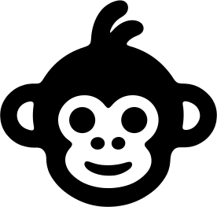

<div align="center">



# logo-as-code-skill

**Turn a hand-drawn logo into clean, reproducible code.**

A [Claude Code](https://docs.anthropic.com/en/docs/claude-code) skill that fits smooth
cubic Bézier curves to a sketched / scanned mark's real outline — producing an editable
SVG, a matrix of color &amp; layout variants, and PNG / ICO / favicon exports.


</div>

---

A hand-drawn logo is charming but **unmeasurable** — a flat image, or an SVG of hundreds
of hand-placed points that is rough, uneditable, and not truly scalable. This skill turns
each contour into a small set of **smooth cubic Bézier curves** (genuine parametric
polynomials), fitted *along the original outline* so the hand-drawn character survives,
yet the result is fully mathematical: reproducible, infinitely scalable, parametrically
tweakable, and diff-able in git.

It generalizes the method developed for the
[Chan Meng personal-brand logo](https://github.com/ChanMeng666/chan-meng-personal-brand-logo):
a hand-drawn mark of hundreds of hand-placed points was reconstructed into a small set
of genuine parametric polynomial curves — reproducible, infinitely scalable, and
parametrically tweakable, while preserving the original's hand-drawn character. This
skill packages that pipeline so it can be applied to **any** logo.

## What's inside

```
logo-as-code-skill/
├── SKILL.md                  # the skill: when to use it + the step-by-step workflow
├── references/
│   ├── method.md             # the mathematics (Catmull-Rom → cubic Bézier)
│   ├── layer-structure.md    # contour roles, holes, the even-odd knockout, circles
│   ├── tuning-guide.md       # choosing (resample_step, smoothing_passes)
│   └── bitmap-input.md       # scan/photo → polyline SVG (potrace) first
├── scripts/
│   ├── vectorize.py          # GENERIC engine (Python stdlib only) — never edited per logo
│   └── rasterize.js          # GENERIC SVG → PNG/ICO/favicon exporter (sharp + png-to-ico)
├── examples/
│   └── chan-monkey/          # complete worked example — the template to copy
│       ├── handdrawn.svg     #   the original hand-drawn source
│       ├── build.py          #   per-logo config that drives the engine
│       └── out/              #   generated SVG variants
└── package.json              # rasterize toolchain deps
```

## How the method works

Per closed contour: **parse** the polyline → **dedupe** → **resample** at uniform arc
length → **lightly smooth** out hand jitter → fit a **closed Catmull-Rom spline** →
emit it as exact **cubic Bézier** segments. The fit interpolates every sample point and
is everywhere C¹, so it hugs the drawing while staying smooth. Truly circular parts
(eyes, dots) become exact `<circle>`s. Inner contours become see-through **holes** via
the `even-odd` fill rule. See [`references/method.md`](references/method.md).

## Try the example

```bash
# regenerate the monkey SVG variants (Python stdlib only — no install needed)
python examples/chan-monkey/build.py

# rasterize to PNG / ICO / favicon
npm install
npm run rasterize
```

The example reproduces the published Chan Meng logo assets exactly.

## Install as a Claude Code skill

Copy or symlink this repo into your skills directory so Claude can invoke it on demand:

```powershell
# Windows (PowerShell) — symlink keeps it updated with this repo
New-Item -ItemType SymbolicLink `
  -Path "$env:USERPROFILE\.claude\skills\vectorizing-handdrawn-logos" `
  -Target "D:\github_repository\logo-as-code-skill"
```

```bash
# macOS / Linux
ln -s /path/to/logo-as-code-skill ~/.claude/skills/vectorizing-handdrawn-logos
```

Then in any session, a request like *"turn this hand-drawn logo into an SVG with color
variants and favicons"* triggers the skill, and Claude follows the workflow in
[`SKILL.md`](SKILL.md).

## License

MIT for the code. The Chan Meng monkey logo and "CHAN" wordmark in `examples/` are a
personal brand identity — study the technique, but please don't reuse the mark itself.
